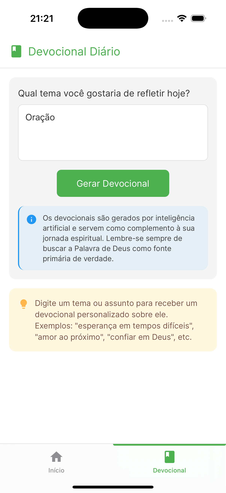

# KerygmaAI

Um aplicativo mobile que utiliza inteligência artificial para gerar devocionais personalizados com base nos temas escolhidos pelo usuário.

## 📋 Significado do Nome

**KerygmaAI** combina dois conceitos poderosos:

- **Kerygma** (κήρυγμα): Palavra grega que significa "proclamação" ou "anúncio", frequentemente utilizada para se referir à proclamação do Evangelho no cristianismo. É o ato de anunciar a mensagem cristã de maneira clara e acessível.

- **AI** (Artificial Intelligence): Representa a tecnologia de inteligência artificial que permite a geração de conteúdo personalizado.

O nome simboliza a missão do aplicativo: utilizar tecnologia moderna (IA) para auxiliar na proclamação e reflexão sobre os ensinamentos cristãos, tornando-os mais acessíveis e personalizados para o dia a dia dos usuários.

## 📱 Screenshots

<div align="center">
  <!-- Adicione suas screenshots aqui. Exemplo: -->
  
  
  
</div>

## 💡 Sobre o Projeto

O KerygmaAI é um aplicativo desenvolvido para ajudar pessoas a terem momentos de reflexão espiritual personalizados. O usuário pode escolher um tema de interesse e o aplicativo gera automaticamente um devocional completo, incluindo:

- Versículo bíblico relacionado
- Introdução ao tema
- Tópicos de estudo detalhados
- Conclusão
- Oração final

Os devocionais gerados são salvos automaticamente no histórico do usuário para consulta posterior, podendo ser compartilhados com amigos e familiares.

## 🚀 Tecnologias Utilizadas

- **React Native** - Framework para desenvolvimento mobile
- **Expo** - Plataforma para desenvolvimento React Native
- **TypeScript** - Linguagem fortemente tipada baseada em JavaScript
- **React Hook Form** - Gerenciamento de formulários
- **Zod** - Validação de formulários
- **OpenAI API** - Geração de conteúdo por IA
- **Async Storage** - Armazenamento local de dados
- **Expo Vector Icons** - Ícones consistentes entre plataformas
- **Expo Router** - Navegação entre telas

## ✨ Funcionalidades

- Geração de devocionais personalizados com IA
- Interface amigável e intuitiva
- Histórico de devocionais consultados
- Compartilhamento de devocionais via aplicativos de mensagem
- Suporte para temas claro e escuro
- Interface adaptada para iOS e Android

## 🛠️ Instalação e Uso

1. Clone o repositório:
```bash
git clone https://github.com/GersonRocha9/kerygma-ai.git
cd kerygma-ai
```

2. Instale as dependências:
```bash
npm install
```

3. Crie um arquivo `.env` com as variáveis de ambiente necessárias:
```
EXPO_PUBLIC_OPENAI_API_KEY=sua_chave_api_aqui
```

4. Execute o projeto:
```bash
npx expo start
```

## 📝 Notas Importantes

- O conteúdo gerado por IA serve como complemento à reflexão espiritual, não substitui a leitura direta da Bíblia ou orientação pastoral.
- É necessária uma chave de API da OpenAI para o funcionamento completo do aplicativo.

## 🤝 Contribuindo

Contribuições são bem-vindas! Sinta-se à vontade para abrir uma issue ou enviar um pull request.

## 📄 Licença

Este projeto está licenciado sob a licença MIT - veja o arquivo LICENSE para detalhes.

---

Desenvolvido com 💚 e ☕
