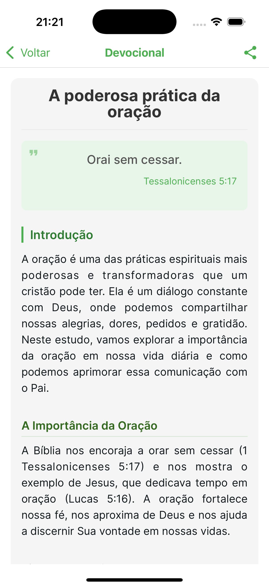

# KerygmaAI

A mobile application that uses artificial intelligence to generate personalized devotionals based on themes chosen by the user.

## 📲 Download

<div align="center" style="display: flex; justify-content: center; align-items: center; flex-wrap: wrap; gap: 20px;">
  <a href="https://apps.apple.com/br/app/kerygmaai/id6742852987?l=en-GB">
    
  </a>
  
  <a href="https://play.google.com/store/apps/details?id=YOUR_PACKAGE_NAME">
    
  </a>
</div>

## 📋 Meaning of the Name

**KerygmaAI** combines two powerful concepts:

- **Kerygma** (κήρυγμα): Greek word meaning "proclamation" or "announcement," often used to refer to the proclamation of the Gospel in Christianity. It is the act of announcing the Christian message in a clear and accessible way.

- **AI** (Artificial Intelligence): Represents the artificial intelligence technology that enables the generation of personalized content.

The name symbolizes the application's mission: to use modern technology (AI) to assist in the proclamation and reflection on Christian teachings, making them more accessible and personalized for users' daily lives.

## 📱 Screenshots

<div align="center">
  <!-- Add your screenshots here. Example: -->
  
  
  
</div>

## 💡 About the Project

KerygmaAI is an application developed to help people have personalized spiritual reflection moments. The user can choose a topic of interest and the application automatically generates a complete devotional, including:

- Related Bible verse
- Introduction to the theme
- Detailed study topics
- Conclusion
- Final prayer

Generated devotionals are automatically saved in the user's history for later reference and can be shared with friends and family.

## 🚀 Technologies Used

- **React Native** - Mobile development framework
- **Expo** - Platform for React Native development
- **TypeScript** - Strongly typed language based on JavaScript
- **React Hook Form** - Form management
- **Zod** - Form validation
- **OpenAI API** - AI content generation
- **Async Storage** - Local data storage
- **Expo Vector Icons** - Consistent icons across platforms
- **Expo Router** - Navigation between screens

## ✨ Features

- Generation of personalized devotionals with AI
- Friendly and intuitive interface
- History of consulted devotionals
- Sharing devotionals via messaging apps
- Support for light and dark themes
- Interface adapted for iOS and Android

## 🛠️ Installation and Usage

1. Clone the repository:
```bash
git clone https://github.com/GersonRocha9/kerygma-ai.git
cd kerygma-ai
```

2. Install dependencies:
```bash
npm install
```

3. Create a `.env` file with the necessary environment variables:
```
EXPO_PUBLIC_OPENAI_API_KEY=your_api_key_here
```

4. Run the project:
```bash
npx expo start
```

## 📝 Important Notes

- The AI-generated content serves as a complement to spiritual reflection, it does not replace direct Bible reading or pastoral guidance.
- An OpenAI API key is required for the full functionality of the application.

## 🤝 Contributing

Contributions are welcome! Feel free to open an issue or submit a pull request.

## 📄 License

This project is licensed under the MIT license - see the LICENSE file for details.

---

Developed with 💚 and ☕
